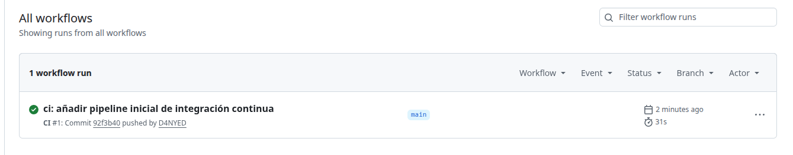

# DevSecOps Secure CI/CD

Proyecto práctico de DevSecOps orientado a la integración de controles de seguridad automatizados dentro de un pipeline CI/CD moderno.

El objetivo es demostrar cómo incorporar pruebas, análisis de seguridad y validaciones automáticas desde las primeras fases del ciclo de desarrollo.

---

## Arquitectura

```text
Developer
    │
    ▼
Git Push
    │
    ▼
GitHub Actions
    │
    ├── Pytest
    ├── Docker Build
    └── Security Controls (próximamente)
```

---

## Tecnologías implementadas

* FastAPI
* Docker
* GitHub Actions
* Pytest

## Tecnologías planificadas

* Trivy
* Semgrep
* OWASP ZAP
* SARIF Reports
* Security Gates

---

## Funcionalidades actuales

### Aplicación web

API desarrollada con FastAPI que expone endpoints básicos para validación y monitorización.

Endpoints disponibles:

```http
GET /
GET /health
```

### Contenerización

La aplicación se ejecuta dentro de un contenedor Docker basado en una imagen Python Slim.

### Hardening básico

Se aplica el principio de mínimo privilegio ejecutando la aplicación mediante un usuario dedicado no privilegiado.

```dockerfile
RUN useradd -m appuser

USER appuser
```

### Pruebas automatizadas

La aplicación dispone de pruebas automatizadas utilizando Pytest.

Actualmente se validan:

* Endpoint raíz
* Endpoint de salud

### Integración continua

Cada push a la rama principal ejecuta automáticamente:

```text
Git Push
   │
   ▼
Pytest
   │
   ▼
Docker Build
   │
   ▼
Success
```

---

## Evidencias

### Pipeline CI funcionando



La pipeline ejecuta automáticamente:

* Instalación de dependencias
* Ejecución de pruebas con Pytest
* Construcción de imagen Docker

---

## Estructura del proyecto

```text
devsecops-secure-ci-cd/
├── .github/
│   └── workflows/
├── app/
├── docs/
│   └── screenshots/
├── reports/
├── tests/
├── Dockerfile
├── requirements.txt
├── README.md
└── .gitignore
```

---

## Estado actual

### Completado

* [x] Aplicación FastAPI
* [x] Contenerización con Docker
* [x] Usuario no privilegiado en contenedor
* [x] Tests automatizados con Pytest
* [x] Pipeline CI con GitHub Actions

### Próximas fases

* [ ] Bandit
* [ ] Semgrep
* [ ] Trivy
* [ ] OWASP ZAP
* [ ] SARIF Reports
* [ ] Security Gates
* [ ] Publicación de imagen en registro de contenedores

---

## Objetivos de aprendizaje

* Integración continua (CI)
* Seguridad en el ciclo de desarrollo (DevSecOps)
* Container Security
* Static Application Security Testing (SAST)
* Dynamic Application Security Testing (DAST)
* Automatización de controles de seguridad
* Hardening de contenedores

---

## Licencia

Proyecto desarrollado con fines educativos y de demostración técnica.
